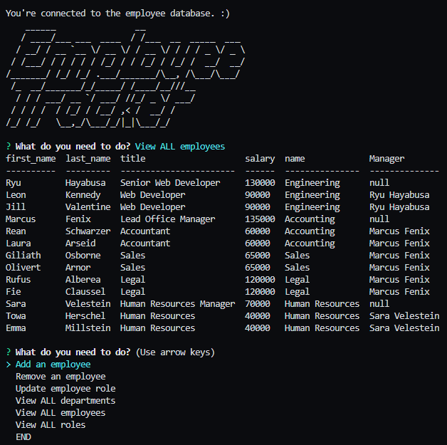

# Employee Tracker DB

## Description 

A solution for managing employees using Node.js, Inquirer.js, and MySQL

The command-line application allows users to:

* Add/Edit/delete employees by role and/or ID
* View all departments, roles, employees
* View employees by manager

  

## Usage 

<a href="https://drive.google.com/file/d/1yDJ36-KeprIbY-jEXi8RKq9tdsNb-UNs/view?usp=sharing" rel="generator demo"></a><br>

1. Clone the repo
```
git clone git@github.com:jshmtchll/employee-tracker.git
```
2. Install the dependencies
```
npm install
```
3. Start the server
```
npm start
```

## Technology
* JavaScript
* Inquirer.js
* MySQL2

## Questions?

GitHub: [@jshmtchll](https://github.com/users/jshmtchll)

Email: jshmtchll@gmail.com